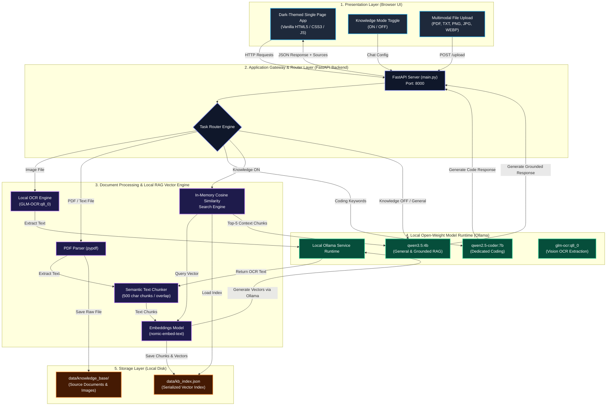

# Task 1 — Document 05: System Architecture

> **Problem Statement ID:** PS 26117 / SIH26117  
> **Title:** Sovereign On-Premise Agentic AI Workbench using Open-Weight Multimodal LLMs for Confidential Industrial Work  
> **Organization:** Mangalore Refinery and Petrochemicals Limited (MRPL)  
> **Category:** Software | **Theme:** Smart Automation  

---

## 🏗️ Architectural Overview

The **Sovereign AI Workbench** is structured around a 4-tier modular, air-gapped architecture. Designed for single-node workstation or edge server deployment, the system decouples user interface, backend routing, vector search processing, and local LLM runtime execution.

---

## 🧩 Architectural Layer Details

### 1. Presentation Layer (Web UI)
- **Technology**: Single-page application using HTML5, CSS3 (Flexbox/Grid, Dark Modern Palette), and asynchronous JavaScript (`fetch` API).
- **Functionality**:
  - Chat window rendering user prompts and AI responses with markdown support.
  - Interactive file uploader with real-time status notifications.
  - Knowledge ON/OFF toggle controlling RAG augmentation.
  - Real-time display of retrieved source documents and cosine similarity scores.

### 2. Application Gateway Layer (`main.py`)
- **Technology**: Python FastAPI with Uvicorn ASGI server.
- **Functionality**:
  - Serves static UI assets (`frontend/index.html`).
  - Endpoints: `POST /upload` for file processing, `POST /chat` for conversational Q&A.
  - **Task Router**: Inspects prompt text and parameters to select the execution path (Coding Model vs. RAG Grounded Model vs. General LLM).

### 3. Document Processing & Local Vector RAG Engine
- **Text Parser**: `pypdf` extracts clean text streams from multi-page PDFs.
- **OCR Extractor**: Invokes `glm-ocr:q8_0` via local Ollama API to transcribe scanned images.
- **Chunking Module**: Splits documents into overlapping semantic chunks (500 characters) to preserve contextual boundaries.
- **Embedding Pipeline**: Transmits text chunks to local `nomic-embed-text` model via Ollama to generate 768-dimensional dense vector representations.
- **Vector Storage & Search**: Saves chunk metadata and vectors into `data/kb_index.json`. Executes fast in-memory dot-product cosine similarity search to retrieve top-K matching contexts.

### 4. Local Model Execution Layer (Ollama)
- **Runtime**: Ollama daemon running on localhost (`http://127.0.0.1:11434`).
- **Model Palette**:
  - `qwen3.5:4b`: Primary general-purpose LLM for conversational chat and grounded RAG synthesis.
  - `qwen2.5-coder:7b`: Code generation specialist.
  - `glm-ocr:q8_0`: Document image OCR specialist.
  - `nomic-embed-text`: High-speed text embedding generator.

### 5. Storage Layer
- **Physical Disk Storage**: All files reside in local workstation directory `d:\isha\sovereign-ai\data\`.
- **Air-Gap Security**: Zero external network connections; completely self-contained.
