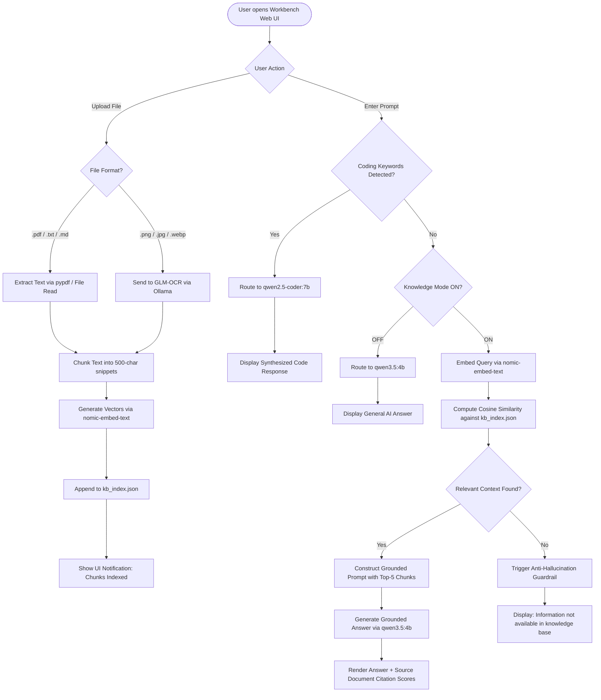
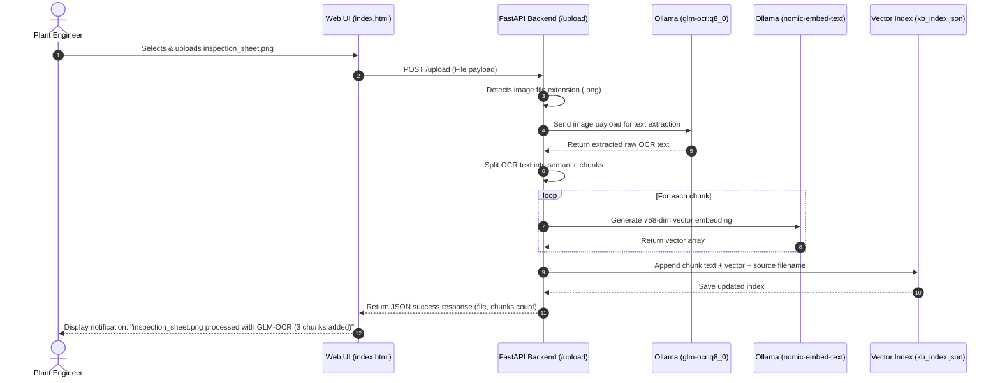
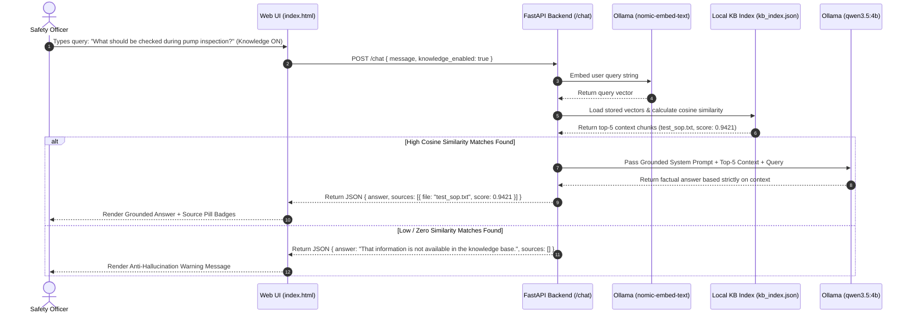
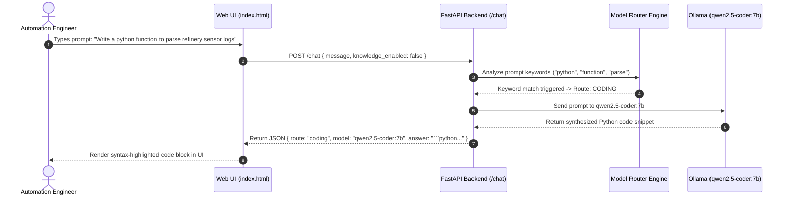

# Task 1 — Document 06: Workflow & User Flow Diagrams

> **Problem Statement ID:** PS 26117 / SIH26117  
> **Title:** Sovereign On-Premise Agentic AI Workbench using Open-Weight Multimodal LLMs for Confidential Industrial Work  
> **Organization:** Mangalore Refinery and Petrochemicals Limited (MRPL)  
> **Category:** Software | **Theme:** Smart Automation  

---

## 🔀 1. High-Level User Flow Chart

---

## 🔄 2. Detailed Sequence Diagrams

### Sequence 1: Image Upload & GLM-OCR Ingestion Pipeline

---

### Sequence 2: Grounded RAG Query Execution (Knowledge ON)

---

### Sequence 3: Code Generation Task Routing

