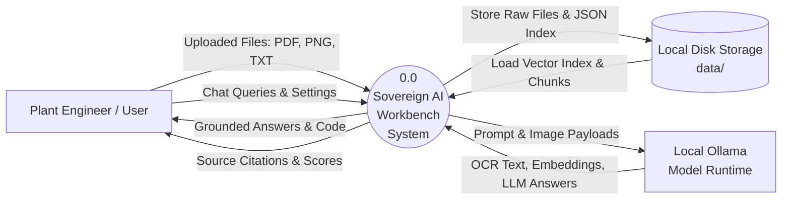
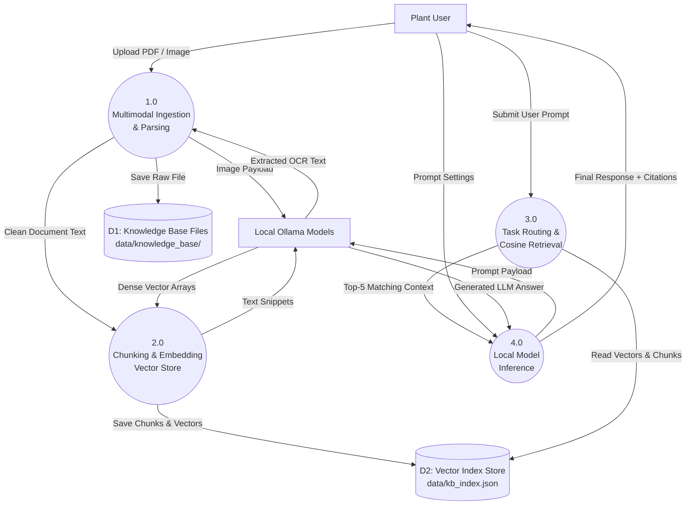
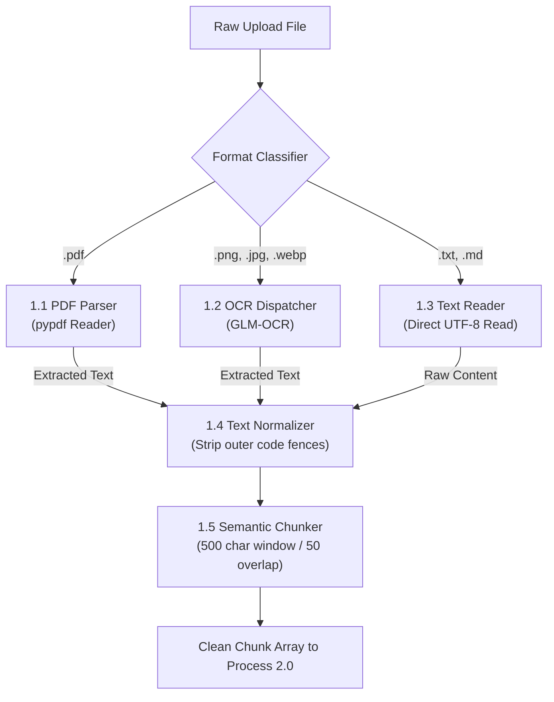

# Task 1 — Document 07: Data Flow Diagrams (DFD)

> **Problem Statement ID:** PS 26117 / SIH26117  
> **Title:** Sovereign On-Premise Agentic AI Workbench using Open-Weight Multimodal LLMs for Confidential Industrial Work  
> **Organization:** Mangalore Refinery and Petrochemicals Limited (MRPL)  
> **Category:** Software | **Theme:** Smart Automation  

---

## 📊 1. DFD Level 0 — Context Diagram

The Level 0 Context Diagram represents the system boundary of the **Sovereign AI Workbench**, showing external entities (Plant User, Local Disk Storage, Local Model Runtime) and major data inputs/outputs.

---

## 🔄 2. DFD Level 1 — System Process Overview

Level 1 decomposes the system into four main logical data processes: Document Parsing/OCR, Vector Embedding & Indexing, Task Routing & Retrieval, and Grounded Inference.

---

## 🔬 3. DFD Level 2 — Process 1.0 (Multimodal Document & Image Ingestion Pipeline)

Level 2 zooms into Process 1.0 to depict the exact transformation steps from raw uploaded documents to clean text chunks.

---

## 📖 4. Data Dictionary

| Data Element | Type | Source | Destination | Description |
|---|---|---|---|---|
| `uploaded_file` | Binary Stream | User UI | Process 1.0 | PDF document or image file uploaded via form payload. |
| `ocr_prompt_payload` | Base64 / Path | Process 1.2 | Ollama (`glm-ocr`) | Image payload sent to local OCR model. |
| `raw_text_stream` | String | Process 1.0 | Process 1.4 | Extracted text before normalization. |
| `chunk_record` | JSON Object | Process 2.0 | `D2: kb_index.json` | Contains `chunk_id`, `text`, `source_file`, and 768-dim `embedding` array. |
| `user_query` | String | User UI | Process 3.0 | Text prompt entered by user in Web UI. |
| `query_vector` | Array[768] | Process 3.0 | Cosine Search Engine | 768-dimensional float embedding of user query. |
| `cosine_match_score` | Float [0.0 - 1.0] | Cosine Search Engine | Process 4.0 | Cosine similarity score between query vector and chunk vector. |
| `grounded_response` | JSON Object | Process 4.0 | User UI | Contains generated LLM answer text, route used, and source document metadata array. |
